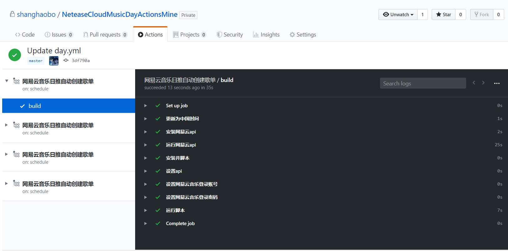

## 功能
利用GithubActions将网易云音乐日推歌曲自动备份到新歌单（无需服务器）
## 使用步骤
- 在自己的Github上创建个新仓库
- 在仓库创建 /.github/workflows/day.yml
- 将day.yml里面的phone和password里面的xxx替换成自己的网易云账号密码即可
- 第一次创建后等待1小时，以后每小时脚本会自动运行一次进行检测，可在项目上方的Actions里查看运行记录
## 使用效果



## day.yml
```yaml
name: 网易云音乐日推自动创建歌单

on:
  schedule:
    # * is a special character in YAML so you have to quote this string
    - cron:  '0 0/3 * * *'

jobs:
  build:

    runs-on: ubuntu-latest

    steps:
    - name: 更新为中国时间
      run: |
        sudo rm -rf /etc/localtime 
        sudo ln -s /usr/share/zoneinfo/Asia/Shanghai /etc/localtime
        date
    - name: 安装网易云api
      run: git clone https://github.com/shanghaobo/NeteaseCloudMusicApi.git
    - name: 运行网易云api
      run: |
        cd NeteaseCloudMusicApi
        npm install
        nohup node app.js &
    - name: 安装并脚本
      run: git clone https://github.com/shanghaobo/NeteaseCloudMusicDay.git
    - name: 设置api
      run: echo "api='http://127.0.0.1:3000'" >> NeteaseCloudMusicDay/config.py
    - name: 设置网易云音乐登录账号
      run: echo "phone='xxxxxxxxxxx'" >> NeteaseCloudMusicDay/config.py
    - name: 设置网易云音乐登录密码
      run: echo "password='xxxxxx'" >> NeteaseCloudMusicDay/config.py
    - name: 运行脚本
      run: python3 NeteaseCloudMusicDay/main2.py

```